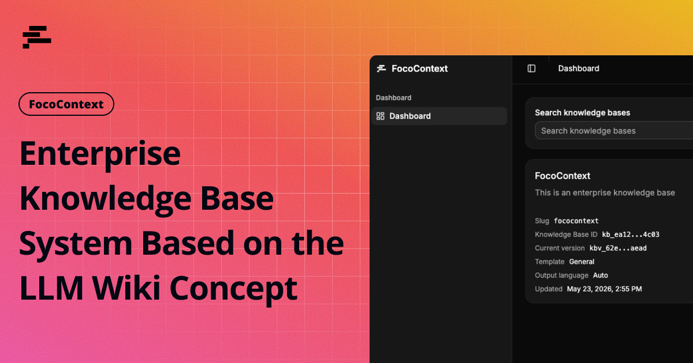
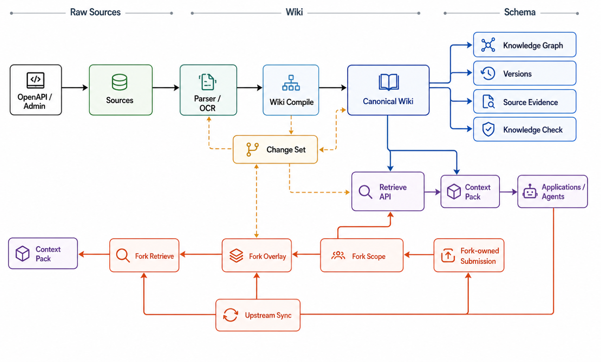

<p align="center">
  
</p>

<h1 align="center">FocoContext</h1>

<p align="center">
  <strong>面向开发者产品的自托管 Wiki 优先知识基础设施。</strong>
  <br />
  把文档编译成持续生长的 Wiki 页面、图谱关系、来源证据、版本和 Agent 可直接使用的检索上下文。
</p>

<p align="center">
  <a href="https://docs.fococontext.com/zh-CN/">文档</a> ·
  <a href="#快速开始">快速开始</a> ·
  <a href="https://docs.fococontext.com/zh-CN/openapi/integration-flow">API 指南</a> ·
  <a href="https://docs.fococontext.com/zh-CN/help/introduction">架构</a> ·
  <a href="README.md">English</a> ·
  <a href="README.zh-CN.md">简体中文</a>
</p>

<p align="center">
  
  
  
  
</p>

---

FocoContext 为开发团队提供一层会持续变强的知识层。上传文档，系统把资料编译成持久化 Wiki 页面，应用通过 API 获取适合 Agent、后端服务和内部工具使用的上下文。

原始资料保持可追溯。Wiki 页面成为被维护的知识表面。图谱关系解释知识之间的连接。版本记录保留知识库每一次变化的轨迹。

FocoContext 继承 [Andrej Karpathy 的 LLM Wiki 模式](https://gist.github.com/karpathy/442a6bf555914893e9891c11519de94f)：LLM 从资料中持续维护一个持久 Wiki，让知识成为会复利增长的活资产。FocoContext 把这套方法做成 API 优先、自托管的服务端基础设施。

<p align="center">
  
</p>

## 为什么选择 FocoContext

### 知识应该复利增长

文档会以 PDF、Office 文件、Markdown、表格、导出页面、日志和网页抓取等形态进入系统。FocoContext 解析它们，抽取可用 Markdown，保留来源定位，并把资料编译成每一次查询都能复用的 Wiki 页面。

### Agent 需要稳定的知识表面

Agent 拿到有页面身份、引用、图谱邻居、answerability 信号和受控来源证据的上下文时，推理会更稳。FocoContext 通过 OpenAPI 和 TypeScript SDK 交付这层上下文。

### 团队需要掌控变化

每次入库都会形成任务、产物、变更集、版本和追踪记录。运维者可以检查失败、重试任务、重建索引、审阅图谱结构、解析来源证据，并保留完整审计轨迹。

## 核心能力

**1. Wiki 优先入库**  
源文档会被编译成 Wiki 页面、来源摘要、系统页面、关系和版本。长期知识表面由 Wiki 承载。

**2. 可追溯来源的检索**  
Retrieve 返回以页面为中心的结果、引用、来源定位、上下文包、可回答性 metadata 和可选追踪信息。应用可以通过 OpenAPI 把引用解析到受控来源证据。

**3. 图谱增强上下文**  
FocoContext 从 Wiki 链接、共享来源、共同邻居和类型亲和度构建关系。Retrieve 可以从种子结果扩展到邻近上下文，并给出清晰的关系路径。

**4. 类 Git 知识版本**  
知识库维护版本、页面版本、变更集、差异、回滚记录和知识检查发现项。更新会进入可审阅的历史。

**5. Fork 私有提交**  
开发者应用可以把用户或工作区拥有的生成内容写入隔离 fork。Canonical 知识保持干净，fork 检索可以看到私有覆盖层。

**6. API 优先运维**  
管理后台和外部应用调用同一套 REST API。知识库、文档、任务、页面、图谱、检索、来源证据、Webhook 和 fork 都有 OpenAPI 契约。

**7. 自托管运行时**  
本地栈通过 Docker Compose 运行：API 服务、Worker、管理后台、PostgreSQL + pgvector、Redis + BullMQ、兼容 S3 的对象存储，以及可选 RapidOCR sidecar。

**8. 模型与供应商可替换**  
聊天模型、嵌入、重排、图片描述、OCR、存储和运行时限制都通过环境变量配置。兼容 OpenAI 的端点是一等配置目标。

## 测试情况说明

这组结果来自受控环境中的小样本测试，测试资料已经过清洗。由于测试环节时间有限，仅使用了少量样本；如果用于更大规模的生产环境，需要结合实际文档规模、业务领域、模型配置和质量要求继续评测，并对相关逻辑和算法进行修正。

| 测试项                     | 覆盖范围                                                                           | 测试结果                                                                                                                                                                                                                                                                                                                                                                        |
| -------------------------- | ---------------------------------------------------------------------------------- | ------------------------------------------------------------------------------------------------------------------------------------------------------------------------------------------------------------------------------------------------------------------------------------------------------------------------------------------------------------------------------- |
| 混合文档 OpenAPI 质量      | 6 份代表性资料，覆盖 Markdown、PDF 衍生内容、表格/OCR 内容和 Office；20 个检索任务 | 上传成功率 100%，入库完成率 100%，metadata preservation 100%，selected-document Wiki coverage 100%，title Recall@1/3 100%，context precision@5 100%，citation exactness 100%，answer relevance 99%，Retrieve p95 latency 7.9s                                                                                                                                                   |
| 无答案与置信度契约         | 同一组混合文档资料，加上可回答性探测；23 个任务                                    | no-answer precision 100%，no-answer false positives 0%，answerable false negatives 0%，unsupported-answer prevention 100%，confidence calibration pass rate 100%                                                                                                                                                                                                                |
| 法律 Markdown OpenAPI 质量 | 10 份结构化法律 Markdown 资料；40 个检索、metadata、locator 和 agent-intent 任务   | upload、ingest、frontmatter preservation、Wiki coverage、evidence dereference、visible top-result correctness、source ranking、anchor ranking、citation source hit、exact locator resolution、title Recall@1/3、Recall@5、MRR@10、nDCG@10、citation exactness 和 agent-task success 全部 100%；context-pack source precision 96%；groundedness 96.3%；Retrieve p95 latency 4.2s |

## 快速开始

### 环境要求

- Docker 和 Docker Compose
- 一个兼容 OpenAI 的聊天模型端点
- 一个兼容 OpenAI 的嵌入模型端点
- 一个外部或托管的兼容 S3 的对象存储端点
- 只有源码开发和本地脚本需要 Node.js 22+ 与 pnpm 10+

### 1. 准备本地文件

```bash
cp .env.example .env
cp docker-compose.example.yml docker-compose.yml
```

启动前编辑 `.env`。至少需要设置：

```bash
# docker-compose.example.yml 必填。使用 Git 发布标签对应的精确 Docker 镜像标签，
# 例如 v0.1.0 -> 0.1.0。
FOCOCONTEXT_IMAGE_TAG=0.1.0

# 公开 GHCR 镜像命名空间。只有使用自定义 registry 时才需要覆盖。
FOCOCONTEXT_IMAGE_NAMESPACE=ghcr.io/farozerolabs

# 发布端口默认只监听本机，适合反向代理部署。
# 只有明确需要直接开放服务端口时，才使用 0.0.0.0。
FOCOCONTEXT_BIND_HOST=127.0.0.1

FOCOCONTEXT_ADMIN_PASSWORD=...
FOCOCONTEXT_API_KEY=...
POSTGRES_PASSWORD=...
DATABASE_URL=postgresql://fococontext:<same-postgres-password>@postgres:5432/fococontext

S3_ACCESS_KEY_ID=...
S3_SECRET_ACCESS_KEY=...

CHAT_PROVIDER_NAME=...
CHAT_BASE_URL=...
CHAT_API_KEY=...
CHAT_DEFAULT_MODEL=...
CHAT_ANALYSIS_MODEL=...
CHAT_GENERATION_MODEL=...
CHAT_MERGE_MODEL=...

EMBEDDING_PROVIDER_NAME=...
EMBEDDING_BASE_URL=...
EMBEDDING_API_KEY=...
EMBEDDING_MODEL=...
EMBEDDING_DIMENSIONS=1536
```

### 2. 启动发布栈

```bash
docker compose up -d
```

`docker-compose.example.yml` 会从 GitHub Container Registry 的 `ghcr.io/farozerolabs`
拉取已发布的 API、Worker、Admin 和 OCR 镜像。`FOCOCONTEXT_IMAGE_TAG` 是必填项，推荐固定到明确的已发布镜像版本，例如 `0.1.0`。

发布端口默认通过 `FOCOCONTEXT_BIND_HOST=127.0.0.1` 只监听本机，适合由 Nginx、Caddy、Traefik 或其他宿主机反向代理对外提供 HTTPS 域名。只有明确需要直接开放服务端口时，才设置 `FOCOCONTEXT_BIND_HOST=0.0.0.0`。`FOCOCONTEXT_API_PORT`、`FOCOCONTEXT_ADMIN_PORT`、`FOCOCONTEXT_POSTGRES_PORT` 和 `FOCOCONTEXT_REDIS_PORT` 继续只填写数字端口，例如 `18080`；不要把 `127.0.0.1:18080` 这类带 host 的值填进这些端口字段。

维护者发布新镜像后，需要先确认 GHCR packages 已设置为 public，并且可以在 FocoContext 仓库 packages 页面看到，再对外引用这个版本。

### 3. 打开控制台

| 服务         | URL                                   |
| ------------ | ------------------------------------- |
| 管理后台     | `http://localhost:18081`              |
| API 健康检查 | `http://localhost:18080/health`       |
| OpenAPI JSON | `http://localhost:18080/openapi.json` |

管理后台登录使用：

```bash
FOCOCONTEXT_ADMIN_USERNAME
FOCOCONTEXT_ADMIN_PASSWORD
```

开发者 API 调用使用：

```http
Authorization: Bearer <FOCOCONTEXT_API_KEY>
```

`GET /openapi.json` 是受保护的机器可读契约。你可以使用已登录的管理后台会话，也可以发送 `Authorization: Bearer <FOCOCONTEXT_API_KEY>`。匿名请求会被拒绝。

## 使用 FocoContext

### 使用 Docker Compose 自托管

发布式自托管部署使用基于镜像的 Compose 模板。模板默认使用外部兼容 S3 的存储和环境变量中配置的模型供应商。

```bash
docker compose up -d
```

默认模板会启动全量服务：API、Worker、Admin、PostgreSQL、Redis 和内置 OCR 服务。

资源较小的服务器可以使用 optional-OCR 模板：

```bash
OCR_ENABLED=false docker compose -f docker-compose.optional-ocr.example.yml up -d
```

需要处理扫描版或低文本 PDF 时，再用这个模板启动 OCR：

```bash
OCR_ENABLED=true docker compose -f docker-compose.optional-ocr.example.yml --profile ocr up -d
```

双域名反向代理部署时，建议端口继续只绑定本机，并在 `.env` 中写入公网访问地址：

```env
FOCOCONTEXT_BIND_HOST=127.0.0.1
FOCOCONTEXT_CORS_ORIGINS=https://foco.example.com
FOCOCONTEXT_ADMIN_API_BASE_URL=https://api.example.com/v1
FOCOCONTEXT_ADMIN_BASE_URL=https://foco.example.com
```

```nginx
server {
  listen 443 ssl http2;
  server_name foco.example.com;

  client_max_body_size 256m;
  proxy_read_timeout 300s;
  proxy_send_timeout 300s;

  location / {
    proxy_pass http://127.0.0.1:18081;
    proxy_http_version 1.1;
    proxy_set_header Host $host;
    proxy_set_header X-Real-IP $remote_addr;
    proxy_set_header X-Forwarded-For $proxy_add_x_forwarded_for;
    proxy_set_header X-Forwarded-Proto $scheme;
  }
}

server {
  listen 443 ssl http2;
  server_name api.example.com;

  client_max_body_size 256m;
  proxy_read_timeout 300s;
  proxy_send_timeout 300s;

  location / {
    proxy_pass http://127.0.0.1:18080;
    proxy_http_version 1.1;
    proxy_set_header Host $host;
    proxy_set_header X-Real-IP $remote_addr;
    proxy_set_header X-Forwarded-For $proxy_add_x_forwarded_for;
    proxy_set_header X-Forwarded-Proto $scheme;
  }
}
```

### 从源码构建

```bash
pnpm install
pnpm run docker:up
```

开发命令使用 `docker-compose.dev.example.yml`，从本地源码构建镜像，在后台启动服务栈，移除孤立容器，并清理当前 Compose 项目标签下的陈旧 Docker 资源。正在使用的 PostgreSQL 和 Redis volume 会保留。

开发栈默认也会启动 OCR。保留下面的脚本作为同等入口：

```bash
pnpm run docker:up:ocr
```

### 通过 API 集成

运行 OpenAPI 快速开始示例：

```bash
export FOCOCONTEXT_BASE_URL=http://localhost:18080
export FOCOCONTEXT_API_KEY=<your-api-key>
export FOCOCONTEXT_DOCUMENT_PATH=/absolute/path/to/document.pdf

sh examples/quickstart.curl.sh
```

脚本会创建知识库、上传文档、轮询入库任务、执行 Retrieve，并在图谱上下文可用时执行 Retrieve Expand。

最小 API 流程：

```bash
api_base="http://localhost:18080/v1"

curl "$api_base/knowledge-bases" \
  -H "Authorization: Bearer $FOCOCONTEXT_API_KEY" \
  -H "Content-Type: application/json" \
  -d '{"name":"Engineering Knowledge","template":"team_knowledge","output_language":"en-US"}'
```

### 使用 JavaScript SDK

workspace 内包含 `@fococontext/sdk-js`，可用于类型化 API 调用：

```ts
import { createFococontextClient } from "@fococontext/sdk-js";

const client = createFococontextClient({
  apiKey: process.env.FOCOCONTEXT_API_KEY!,
  baseUrl: "http://localhost:18080/v1",
});

const knowledgeBase = await client.createKnowledgeBase({
  name: "Engineering Knowledge",
  template: "team_knowledge",
  output_language: "en-US",
});

const retrieval = await client.retrieveKnowledgeContext(knowledgeBase.id, {
  query: "What changed in the onboarding flow?",
  mode: "hybrid",
  top_k: 5,
  graph_depth: 1,
  graph_limit_per_result: 5,
  include_graph: true,
  include_context_pack: true,
  include_trace: true,
  context_budget_tokens: 4000,
});

if (retrieval.answerability.no_answer) {
  console.log("No source-backed answer is available.", {
    action: retrieval.answerability.recommended_action,
    reasonCodes: retrieval.answerability.reason_codes,
  });
}
```

完整脚本见 `examples/sdk-ready-quickstart.ts`。

## 核心 API

| 端点                                                                                                  | 用途                           |
| ----------------------------------------------------------------------------------------------------- | ------------------------------ |
| `POST /v1/knowledge-bases`                                                                            | 创建知识库                     |
| `POST /v1/knowledge-bases/{knowledge_base_id}/documents`                                              | 上传源文档                     |
| `POST /v1/knowledge-bases/{knowledge_base_id}/documents/upload-sessions`                              | 创建直传会话                   |
| `POST /v1/knowledge-bases/{knowledge_base_id}/documents/upload-sessions/{upload_session_id}/finalize` | 完成直传                       |
| `GET /v1/jobs/{job_id}`                                                                               | 轮询入库和编译进度             |
| `POST /v1/jobs/batch`                                                                                 | 批量查询入库任务状态           |
| `GET /v1/knowledge-bases/{knowledge_base_id}/ingest-progress`                                         | 查看聚合入库进度和检索就绪状态 |
| `GET /v1/knowledge-bases/{knowledge_base_id}/pages`                                                   | 列出生成的 Wiki 页面           |
| `GET /v1/knowledge-bases/{knowledge_base_id}/graph`                                                   | 读取图谱节点和边               |
| `POST /v1/knowledge-bases/{knowledge_base_id}/forks/resolve`                                          | 解析隔离 fork 归属             |
| `POST /v1/forks/{fork_id}/submissions`                                                                | 提交 fork 私有内容             |
| `POST /v1/knowledge-bases/{knowledge_base_id}/retrieve`                                               | 检索 Wiki 优先上下文           |
| `POST /v1/knowledge-bases/{knowledge_base_id}/retrieve/expand`                                        | 从检索结果扩展图谱上下文       |
| `POST /v1/source-evidence/resolve`                                                                    | 批量解析引用证据               |
| `GET /v1/webhooks`                                                                                    | 列出已配置的 Webhook           |
| `POST /v1/webhooks`                                                                                   | 创建带签名的 Webhook           |
| `GET /openapi.json`                                                                                   | 读取受保护的 OpenAPI 3.1 契约  |

## 进阶配置

### 环境变量优先配置

所有运行时配置都优先来自环境变量。管理后台展示安全的运行状态和知识库设置。供应商密钥保存在 `.env` 中。

| 配置领域        | 必要配置                                                                                                                                                                                                          |
| --------------- | ----------------------------------------------------------------------------------------------------------------------------------------------------------------------------------------------------------------- |
| 端口            | `FOCOCONTEXT_BIND_HOST`, `FOCOCONTEXT_API_PORT`, `FOCOCONTEXT_ADMIN_PORT`, `FOCOCONTEXT_POSTGRES_PORT`, `FOCOCONTEXT_REDIS_PORT`                                                                                  |
| 管理后台鉴权    | `FOCOCONTEXT_ADMIN_USERNAME`, `FOCOCONTEXT_ADMIN_PASSWORD`                                                                                                                                                        |
| 开发者 API 鉴权 | `FOCOCONTEXT_API_KEY`, `FOCOCONTEXT_CORS_ORIGINS`                                                                                                                                                                 |
| PostgreSQL      | `POSTGRES_USER`, `POSTGRES_PASSWORD`, `POSTGRES_DB`, `DATABASE_URL`                                                                                                                                               |
| Redis           | `REDIS_URL`                                                                                                                                                                                                       |
| 对象存储        | `S3_PROVIDER_NAME`, `S3_ENDPOINT`, `S3_REGION`, `S3_BUCKET`, `S3_ACCESS_KEY_ID`, `S3_SECRET_ACCESS_KEY`, `S3_OPERATION_*`, `S3_PREVIEW_*`, `S3_MULTIPART_PART_SIZE_BYTES`                                         |
| 聊天模型        | `CHAT_PROVIDER_NAME`, `CHAT_BASE_URL`, `CHAT_API_KEY`, `CHAT_*_MODEL`                                                                                                                                             |
| 嵌入模型        | `EMBEDDING_PROVIDER_NAME`, `EMBEDDING_BASE_URL`, `EMBEDDING_API_KEY`, `EMBEDDING_MODEL`, `EMBEDDING_DIMENSIONS`                                                                                                   |
| 可选重排        | `RERANK_PROVIDER_NAME`, `RERANK_BASE_URL`, `RERANK_API_KEY`, `RERANK_MODEL`                                                                                                                                       |
| 可选图片描述    | `VISION_CAPTION_ENABLED`, `VISION_CAPTION_BASE_URL`, `VISION_CAPTION_API_KEY`, `VISION_CAPTION_MODEL`                                                                                                             |
| OCR             | `OCR_ENABLED`, `OCR_PROVIDER`, `OCR_SERVICE_BASE_URL`, `OCR_LANGS`, `OCR_*` limits                                                                                                                                |
| 来源监听        | `FOCOCONTEXT_SOURCE_WATCH_HOST_DIR`, `FOCOCONTEXT_SOURCE_WATCH_CONTAINER_DIR`, `SOURCE_WATCH_URL_LIST_*`, `SOURCE_WATCH_S3_*`, `SOURCE_WATCH_GIT_*`                                                               |
| 运行时限制      | `UPLOAD_*`, `PARSER_*`, `*_CONCURRENCY`, `DELETION_CLEANUP_*`, `COMPILE_MAX_CONTEXT_CHARS`, `RETRIEVE_*`, `SOURCE_EVIDENCE_*`, `RUNTIME_*`, `PROVIDER_FAILURE_DEGRADED_THRESHOLD`, `EXPENSIVE_VALIDATION_ENABLED` |
| Webhook 投递    | `FOCOCONTEXT_WEBHOOK_SECRET`, `WEBHOOK_DELIVERY_*`, `WEBHOOK_SIGNING_TOLERANCE_SECONDS`                                                                                                                           |

### 兼容 OpenAI 的供应商

聊天模型、嵌入、重排和图片描述供应商分开配置。供应商 base URL 需要暴露兼容 OpenAI 的端点。

```bash
CHAT_BASE_URL=https://your-provider.example/v1
EMBEDDING_BASE_URL=https://your-provider.example/v1
VISION_CAPTION_BASE_URL=https://your-provider.example/v1
```

重排是可选能力。所有 `RERANK_*` 保持为空即可关闭。配置 `RERANK_PROVIDER_NAME`、`RERANK_BASE_URL`、`RERANK_API_KEY` 和 `RERANK_MODEL` 后，Retrieve 重排会启用。

### 运行时并发

`FOCOCONTEXT_QUEUE_CONCURRENCY` 是队列类任务的默认回退值。阶段级配置存在时会覆盖默认值：`SOURCE_PARSE_CONCURRENCY`、`WIKI_ANALYZE_CONCURRENCY`、`WIKI_GENERATE_CONCURRENCY`、`WIKI_MERGE_CONCURRENCY`、`BATCH_IMPORT_CONCURRENCY`、`SOURCE_WATCH_SCAN_CONCURRENCY`、`OCR_CONCURRENCY`、`VISION_CAPTION_CONCURRENCY`、`WEBHOOK_DELIVERY_CONCURRENCY` 和 `DELETION_CLEANUP_CONCURRENCY`。

大型后台任务使用 `BACKGROUND_*` 控制批大小、游标窗口、checkpoint 间隔、重试节奏和 worker 并发。OCR 页级处理继续使用 `OCR_PAGE_CONCURRENCY`；图片 caption provider 调用继续使用 `VISION_CAPTION_IMAGE_CONCURRENCY`。

`PARSER_CONCURRENCY` 在 `SOURCE_PARSE_CONCURRENCY` 未设置时作为来源解析回退值。管理后台设置页会展示生效的运行时配置，并隐藏密钥。

### 兼容 S3 的操作治理

FocoContext 用供应商中立的 Class A / Class B 分类记录兼容 S3 的操作量。Class A 覆盖写入、列表、分片上传、复制、生命周期和 bucket 变更操作。Class B 覆盖对象读取和 metadata 读取。

使用 `S3_OPERATION_METRICS_ENABLED`、`S3_OPERATION_METRICS_WINDOW_SECONDS`、`S3_OPERATION_CLASS_A_WARNING_THRESHOLD` 和 `S3_OPERATION_CLASS_B_WARNING_THRESHOLD` 调整压力展示。`S3_PREVIEW_CACHE_ENABLED` 和 `S3_PREVIEW_MAX_CHARS` 让 parsed-content detail responses 使用持久化 bounded previews。`S3_MULTIPART_PART_SIZE_BYTES` 用于控制 multipart upload part size。

### 来源监听

来源监听支持挂载目录、S3 前缀、URL 列表和 Git 仓库规则，前提是对应运行时适配器已启用。挂载目录由 API 容器通过只读 Docker volume 读取。

```bash
FOCOCONTEXT_SOURCE_WATCH_HOST_DIR=./examples/source-watch
FOCOCONTEXT_SOURCE_WATCH_CONTAINER_DIR=/source-watch
```

规则支持手动扫描、定时扫描、扫描历史、失败状态、重试/退避 metadata，并可选择自动进入正常源文档流水线。

## 检索与 Webhook

Retrieve 以 Wiki 页面作为主要上下文表面，再组合词法匹配、嵌入、图谱扩展、引用、可回答性和可选 context pack。

应用和 Agent 应先检查 `answerability.status`、`confidence`、`evidence_sufficiency`、`no_answer`、`reason_codes` 和 `recommended_action`，再使用返回候选生成带来源背书的最终回答。`confidence` 是确定性的检索证据分数。

Webhook 订阅可以通过 API 或管理后台创建。开启 `FOCOCONTEXT_WEBHOOK_SECRET` 或订阅级 secret 后，投递会带上 `x-fococontext-delivery-id`、`x-fococontext-timestamp`、`x-fococontext-content-digest` 和 `x-fococontext-signature`。

## Fork 私有提交

Fork 私有提交让开发者应用或用户侧 Agent 把生成的 Markdown/text 写入 fork 知识库。Canonical 检索排除 fork 私有提交内容。Fork 检索会组合上游 canonical 页面和当前 fork 私有覆盖层。

典型 API 流程：

1. 创建并入库 canonical 知识库。
2. 使用 `owner_type` 和 `external_owner_id` 解析 fork。
3. 在开发者应用中生成或收集用户拥有的内容。
4. 调用 `POST /v1/forks/{fork_id}/submissions`。
5. 轮询返回的 `job.id`，使用 `GET /v1/jobs/{job_id}`。
6. 从 `/v1/knowledge-bases/{fork_id}/retrieve` 检索。
7. 需要时同步或删除 fork。

## 开发

```bash
pnpm install
pnpm run typecheck
pnpm run lint
pnpm run test
pnpm run build
pnpm run verify
```

验证 Compose 模板：

```bash
docker compose -f docker-compose.example.yml config --quiet
docker compose -f docker-compose.dev.example.yml config --quiet
```

本地运行文档站：

```bash
pnpm run docs:dev
```

## 项目结构

```text
apps/api          REST API 和管理后台鉴权
apps/worker       队列 Worker 和编译流水线
apps/admin-web    React、Vite、shadcn/ui 管理后台
apps/ocr-service  可选 RapidOCR sidecar
apps/docs-site    VitePress 文档站
packages/*        共享契约、存储、解析器、图谱、检索和 SDK
examples          仅使用 API 和 SDK 的快速开始示例
```

## 故障排查

| 现象                 | 检查项                                                                                                  |
| -------------------- | ------------------------------------------------------------------------------------------------------- |
| 管理后台登录失败     | 确认 `.env` 中的 `FOCOCONTEXT_ADMIN_USERNAME` 和 `FOCOCONTEXT_ADMIN_PASSWORD`，然后重启 API/Admin 容器  |
| API 返回 401         | `/v1` 路由使用 `Authorization: Bearer <FOCOCONTEXT_API_KEY>`                                            |
| 上传失败             | 检查 S3 凭证、bucket 是否存在、`S3_FORCE_PATH_STYLE` 和上传大小限制                                     |
| 任务一直排队         | 检查 Worker 健康状态、Redis 健康状态和 `FOCOCONTEXT_QUEUE_CONCURRENCY`                                  |
| 已删除资源仍留在 S3  | 检查 `deletion.cleanup` worker、`DELETION_CLEANUP_*` 限制，以及 Settings -> Operations 中的可重试失败项 |
| 扫描版 PDF 没有内容  | 使用默认全量 Compose 模板，或通过 `docker-compose.optional-ocr.example.yml` 按需启动 OCR                |
| 图片描述被跳过       | 启用 `VISION_CAPTION_ENABLED` 并配置支持 vision 的兼容 OpenAI 模型                                      |
| 来源监听没有发现文件 | 使用 `FOCOCONTEXT_SOURCE_WATCH_CONTAINER_DIR` 下的容器路径                                              |
| 检索没有结果         | 等待入库完成，检查 embeddings，并在知识库设置中重建索引                                                 |

## 贡献

代码、文档、部署和开发者体验相关贡献，请阅读 [贡献指南](CONTRIBUTING.md)。

日常开发以 `dev` 分支为目标。从 `dev` 创建短生命周期 feature 分支，通过 PR
合并回 `dev`；准备发布时，再通过稳定化 PR 将 `dev` 晋升到受保护的 `main`
分支。`main` 保留稳定历史，用于 release tag、Docker 镜像发布和公开文档快照。

欢迎聚焦的 bug 修复、OpenAPI 改进、parser 与 retrieval 优化、Admin UI 打磨，以及自托管文档完善。

## 社区与联系

GitHub Issues 用于 bug 和聚焦的功能请求，GitHub Discussions 用于产品问题、集成模式和自托管经验。

## 关注更新

在 GitHub 上 Star FocoContext，及时关注新版本和产品更新。

## 安全

- `.env` 保持本地私有。提交 `.env.example`，不要提交 `.env`。
- `docker-compose.yml` 保持本地私有。提交示例 Compose 模板。
- 供应商 API key、对象存储凭证、管理后台凭证和 Webhook secret 都只放在环境变量中。
- 管理后台只展示安全状态 metadata 和脱敏配置。
- 漏洞报告流程见 [SECURITY.md](SECURITY.md)。

## 特别感谢

FocoContext 的灵感来自
[Andrej Karpathy 的 LLM Wiki 理念](https://gist.github.com/karpathy/442a6bf555914893e9891c11519de94f)，以及
[nashsu/llm_wiki](https://github.com/nashsu/llm_wiki) 项目。

## 许可证

FocoContext 使用修改版 Apache License 2.0 发布，并针对多租户服务和前端 LOGO/copyright 信息附加额外条件。完整条款见 [LICENSE](LICENSE)。
